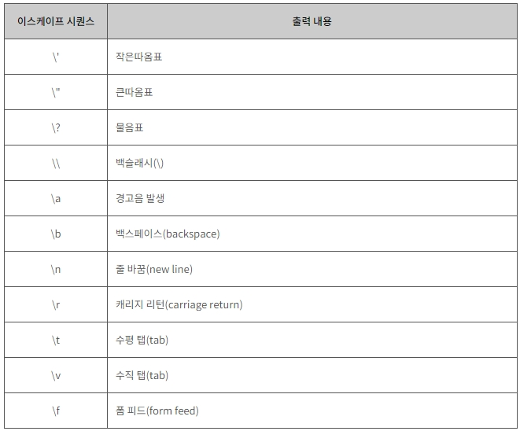
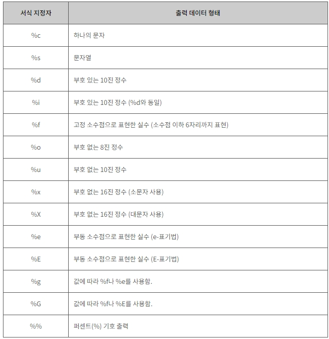

20220726
=============

변수, 상수
-------------
1. 정수형 변수
    ```C
    int age = 12; // 정수형 변수 선언.
    printf("%d\n", age);
    ```

2. 실수형 변수
    ```C
    float f = 46.5 // 실수형 변수 선언
    printf("%.2f\n", f);

    double d = 4.428;
	printf("%.2f\n", d);
    ```

3. 상수 : 변하지 않는 수
    ```C
    const int YEAR = 2000; // 변수 타입 앞에 const 추가
    ```
    
4. 문자(한 글자)
    ```C
    char c = 'A';
    printf("%c\n", c);
    ```

5. 문자열
    ```C
    char str[256];
    printf("%s\n", str);
    ```

입력, 출력
-------------
1. printf
    * f : formatted, 서식화된 출력 지원.

    * Escape Sequence
    
    
    * 서식 지정자(Format Specifier)
    


2. scanf_s : 키보드 입력을 받아서 저장
    ```C
    scanf_s("%d %d %d", &one, &two, &three);
    // one, two, three에 차례대로 키보드로 입력 받은 값 할당. 공백으로 값 구분.

    scanf_s("%s", str, sizeof(str));
    // 문자열을 입력으로 받을 때에는 문자열의 크기를 함께 입력 해야 한다.
    ```
