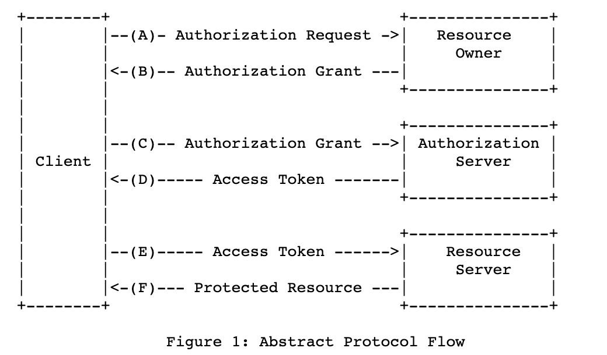

OAuth
=============

* 공부일자 : 2023.10.30
* Reference : https://velog.io/@kjhxxxx/OAuth-OAuth-2.0-%EC%9D%B4%EB%9E%80

OAuth(Open Authorization)
--------------
* 인터넷 사용자들이 비밀번호를 제공하지 않고 다른 웹사이트 상의 자신들의 정보에 대해 웹사이트나 애플리케이션의 접근 권한을 부여할 수 있는 공통적인 수단으로서 사용되는, 접근 위임을 위한 개방형 표준이다.
* 다양한 플랫폼에서 권한 부여를 위한 산업 표준 프로토콜이다.

OAuth 탄생 배경
--------------
* 기존의 인증방식 표준은 id와 password 였다. id와 password를 직접 입력받아 저장하고, 필요할 때마다 불러와서 사용을 해야 했는데, 아래와 같은 문제가 발생할 수 있다.
    * 사용자: 자신의 id와 password를 공개하는 것에 대하여 신뢰하기 어렵다.
    * 서버: 보안 문제가 생기는 경우 모든 책임을 져야 한다.
    * 다른 사이트: 내가 만든 서버를 신뢰할 수 없다.

* 이러한 문제를 해결하기 위해 2006년 11월 트위터 개발자와 Ma.gnolia의 개발자가 안전한 인증방식에 대한 논의를 하면서 OAuth가 등장했다.

OAuth2.0 인증 흐름도
--------------

