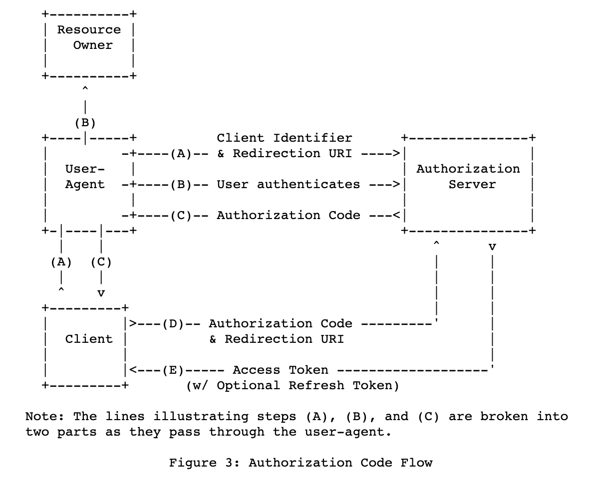
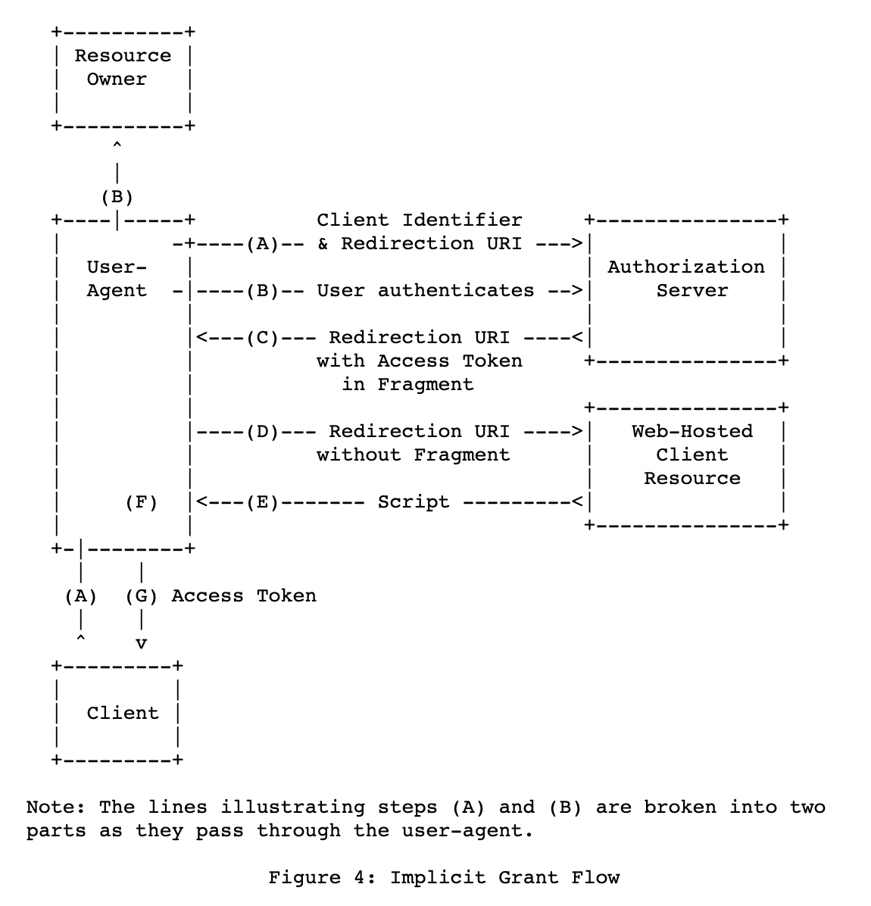
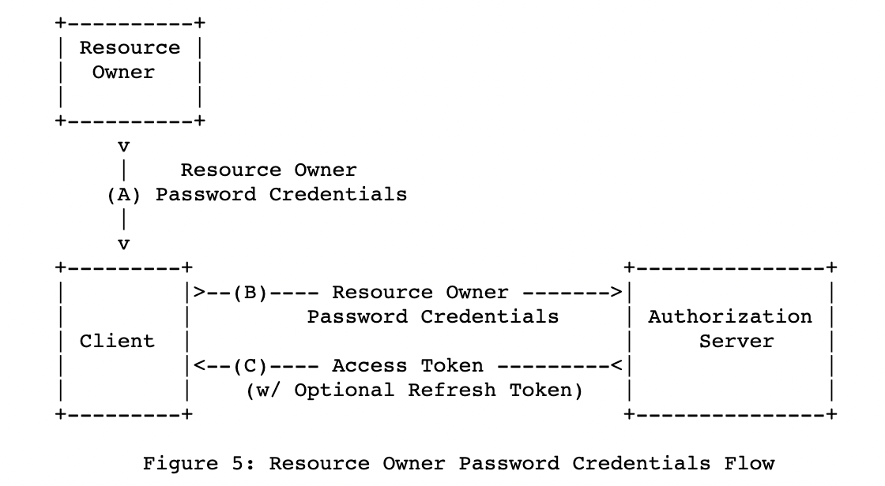
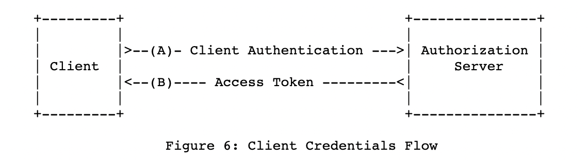

OAuth
=============

* 공부일자 : 2023.10.30
* Reference : https://velog.io/@kjhxxxx/OAuth-OAuth-2.0-%EC%9D%B4%EB%9E%80

OAuth(Open Authorization)
--------------
* 인터넷 사용자들이 비밀번호를 제공하지 않고 다른 웹사이트 상의 자신들의 정보에 대해 웹사이트나 애플리케이션의 접근 권한을 부여할 수 있는 공통적인 수단으로서 사용되는, 접근 위임을 위한 개방형 표준이다.
* 다양한 플랫폼에서 권한 부여를 위한 산업 표준 프로토콜이다.

OAuth 탄생 배경
--------------
* 기존의 인증방식 표준은 id와 password 였다. id와 password를 직접 입력받아 저장하고, 필요할 때마다 불러와서 사용을 해야 했는데, 아래와 같은 문제가 발생할 수 있다.
    * 사용자: 자신의 id와 password를 공개하는 것에 대하여 신뢰하기 어렵다.
    * 서버: 보안 문제가 생기는 경우 모든 책임을 져야 한다.
    * 다른 사이트: 내가 만든 서버를 신뢰할 수 없다.

* 이러한 문제를 해결하기 위해 2006년 11월 트위터 개발자와 Ma.gnolia의 개발자가 안전한 인증방식에 대한 논의를 하면서 OAuth가 등장했다.

OAuth2.0 인증 흐름도
--------------

1. Client 측에서 Resource Owner에게 인증방식 4가지 중 하나로 승인을 요청한다.
2. Resource Owner 측에서 Client 측으로 인증 권한을 부여한다.
3. Client는 부여 받은 인증 권한으로 Authorization Server에 Access Token을 요청한다.
4. Authorization Server에서 Client와 부여 받은 인증 권한에 대한 유효성을 검사 후 통과하면 Access Token을 부여한다.
5. Client는 받아온 Access Token을 이용하여 Resource Owner의 Resource에 접근을 요청한다.
6. Resource Server는 해당 Access Token의 유효성을 검사한 후 통과하면 Resource를 Client에게 넘겨준다.

OAuth2.0 인증 절차 종류(인증 방식)
--------------
* Authroization Code Grant
    
    * Client가 다른 사용자 대신 특정 리소스에 접근을 요청할 때 사용.
    * 리소스 접근을 위해, Authorization Server에서 받은 권한 코드로 리소스에 대한 액세스 토큰을 받는 방식.
    * 다른 인증 절차에 비해 보안성이 높기에 주로 사용.
* Implicit Grant
    
    * Authorization Code Grant와 다르게 권한 코드 교환 단계가 있음.
    * 액세스 토큰을 즉시 반환받아 이를 인증에 이용하는 방식.
* Resource Owner Password Credentials Grant
    
    * Client가 암호를 사용하여 액세스 토큰에 대한 사용자의 자격 증명을 교환하는 방식
    * Resouce Owner에서 ID, Password를 전달 받아 Resource Server에 인증하는 방식으로 신뢰할 수 있는 Client를 추가하는 기능.
* Client Credentials Grant
    
    * Client가 Context 외부에서 액세스 토큰을 얻어 특정 리소스에 접근을 요청할 때 사용하는 방식.